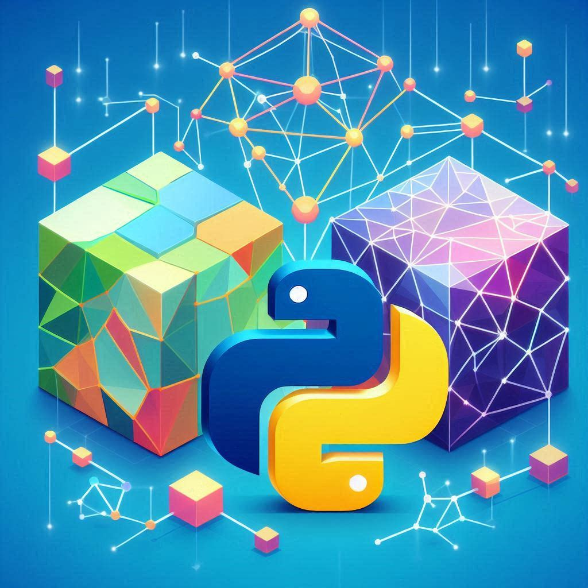

# Machine Learning Exploration with Python and Tensorflow

## Overview
Welcome to my final project for the Associate Degree in Multiplatform Software Development. This repository is a collection of various projects that delve into the fascinating world of Machine Learning, utilizing Python and Tensorflow. Designed with practicality in mind, each project is executable in Google Colab, providing a seamless and accessible experience for anyone interested in the field.

## Projects
Each project within this repository is a standalone exploration of different Machine Learning concepts. From neural networks to natural language processing, these projects cover a broad spectrum of the discipline.

## Technologies
- **Python**: The core programming language used for all projects.
- **Tensorflow**: An open-source framework for numerical computation and machine learning.
- **Google Colab**: A cloud-based platform that allows for the execution of Python code and seamless collaboration.

## Acknowledgments
- My professors and peers at the Associate Degree program [CEU](https://www.ceu.es/)
